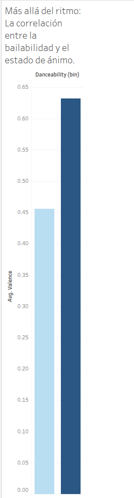
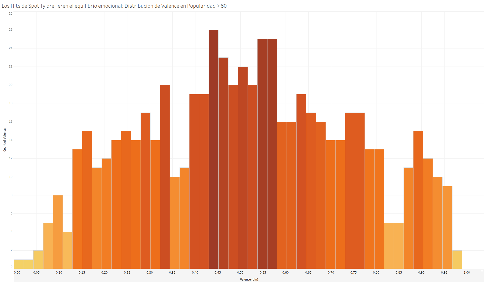

# Análisis de Éxito Musical en Spotify

## Objetivo del Proyecto
Analizar qué características de audio (valencia, acústica, tonalidad) tienen mayor impacto en la popularidad de las canciones en Spotify, utilizando un dataset de 89k canciones únicas.

## Proceso de Limpieza
Se realizó una limpieza de datos en R, eliminando duplicados mediante un filtrado estricto por `track_id` y normalización de variables, pasando de un dataset original de 114k filas a uno de 89.7k registros precisos.

## Insights Clave

### 1. Más allá del ritmo: La correlación entre la bailabilidad y el estado de ánimo."

* El análisis confirma una correlación positiva clara: a mayor capacidad bailable (danceability), más alta es la valencia de la canción. Esto valida que las estructuras musicales diseñadas para el movimiento tienden a utilizar tonalidades y ritmos asociados con emociones positivas, confirmando que la 'felicidad' musical es un componente clave en el diseño de canciones bailables.

### 2. El equilibrio emocional de los Hits

* Al aislar las canciones más populares del mercado, observamos que estas no se inclinan hacia los extremos. Los éxitos mundiales se concentran en una valencia neutra (0.4 - 0.6), sugiriendo que la música de consumo masivo busca un balance emocional que resulte atractivo para una audiencia global y diversa, evitando polarizar a los oyentes.

### 3. El castigo de la acústica: ¿Por qué las canciones acústicas son menos populares?
* Los datos revelan que las composiciones con alta acústica (>0.8) tienen una valencia significativamente menor (0.35) frente a las producciones sintéticas. Este análisis demuestra que el mercado actual castiga la 'pureza' acústica con una menor popularidad, sugiriendo que los oyentes de Spotify prefieren producciones con mayor carga de energía y texturas sonoras modernas frente a la melancolía acústica.

### 4.Tonalidad musical vs. Percepción emocional.
* Analizamos si la clave musical (Key) influía en la valencia percibida por el oyente. Los resultados muestran que, independientemente de la tonalidad, la valencia promedio se mantiene constante entre 0.4 y 0.47. Esto descarta la hipótesis de que ciertas claves musicales determinen intrínsecamente si una canción es percibida como 'alegre' o 'triste' por el usuario promedio.

### 5. La música trasciende a la técnica: El impacto de la tonalidad en la popularidad.
* Al evaluar los Hits de Spotify, observamos que ninguna tonalidad específica garantiza el éxito comercial. La popularidad promedio es prácticamente uniforme en todas las claves. Esto refuerza la idea de que los factores determinantes del éxito en Spotify están vinculados a variables de producción (como el género y la energía) más que a la estructura musical técnica.

## Herramientas Utilizadas
- **R (tidyverse):** Limpieza, deduplicación y análisis estadístico.
- **Tableau:** Exploración visual y creación de dashboards.